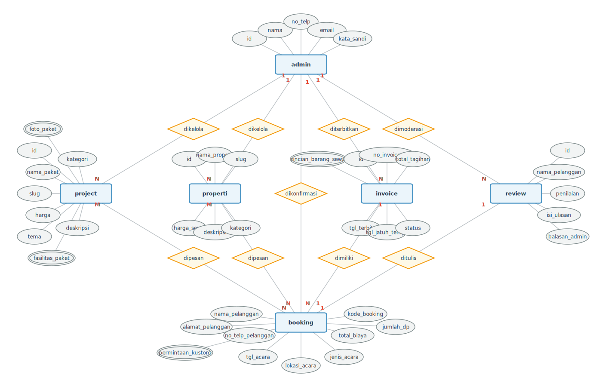
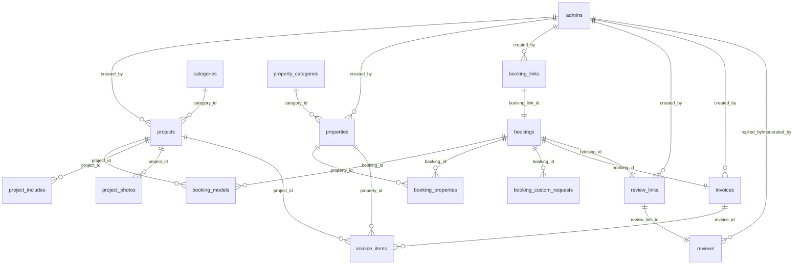

# Dokumentasi Perancangan Database: Maba Wedding

Dokumen ini menjelaskan alur perancangan basis data aplikasi **Maba Wedding (Wedding Organizer & Rental Service)**, mulai dari identifikasi kebutuhan bisnis, perancangan konseptual, proses normalisasi, hingga detail struktur fisik tabel database yang diimplementasikan di backend.

---

## 1. Tahap 1: Identifikasi Entitas dan Atribut

Pada tahap awal perancangan konseptual, kita hanya mengidentifikasi entitas-entitas dasar (core entities) yang muncul langsung dari analisis kebutuhan bisnis utama, sebelum melakukan normalisasi atau memecahnya menjadi entitas teknis baru.

Berikut adalah 6 entitas dasar yang teridentifikasi:

1. **Admin** (Pengelola/Staf Wedding Organizer)
   * Atribut: `id`, `name`, `email`, `password`, `phone`
2. **Pelanggan** (Client yang memesan jasa/menyewa alat)
   * Atribut: `customer_name`, `customer_phone`, `full_address`
3. **Project** (Paket Layanan Pernikahan di Katalog)
   * Atribut: `id`, `title`, `slug`, `price`, `theme`, `description`, `category` (kategori), `foto_paket` (bernilai banyak), `fasilitas_paket` (bernilai banyak)
4. **Properti** (Barang Rental/Sewa Satuan)
   * Atribut: `id`, `name`, `slug`, `description`, `price`, `category` (kategori)
5. **Invoice** (Tagihan Pembayaran)
   * Atribut: `id`, `invoice_number`, `total`, `issue_date`, `due_date`, `status`, `rincian_barang_sewa` (bernilai banyak / array-list)
6. **Review** (Ulasan/Feedback Umpan Balik)
   * Atribut: `id`, `customer_name`, `rating`, `review_text`, `admin_reply`

---

## 2. Tahap 2: ERD Konseptual (Conceptual Data Model)

ERD Konseptual menggambarkan hubungan bisnis tingkat tinggi secara murni antar entitas dasar tanpa memikirkan detail teknis implementasi database fisik. 

Di bawah ini disajikan **2 pilihan pendekatan ERD Konseptual**:

### Opsi A: ERD Konseptual Awal (Relasi Langsung Pelanggan)
Pada opsi ini, Pelanggan terhubung secara langsung ke seluruh entitas transaksi dan katalog. Relasinya menggambarkan fungsionalitas langsung.

**Penjelasan Relasi & Kardinalitas Opsi A:**
* **Admin - Project & Properti ($1 : N$):** Project dan Properti **dikelola** oleh Admin. Satu Admin mengelola banyak Project/Properti ($1 \rightarrow N$).
* **Admin - Invoice ($1 : N$):** Invoice **diterbitkan** oleh Admin. Satu Admin bisa menerbitkan banyak Invoice ($1 \rightarrow N$).
* **Admin - Review ($1 : N$):** Review **dimoderasi/dibalas** oleh Admin. Satu Admin bisa memoderasi banyak Review ($1 \rightarrow N$).
* **Pelanggan - Project & Properti ($N : M$):** Project/Properti **dipesan** oleh Pelanggan. Banyak Pelanggan memesan banyak Project/Properti ($N \rightarrow M$).
* **Pelanggan - Invoice ($1 : N$):** Invoice **dimiliki** oleh Pelanggan. Satu Pelanggan dapat memiliki banyak Invoice dari waktu ke waktu ($1 \rightarrow N$).
* **Pelanggan - Review ($1 : N$):** Review **ditulis** oleh Pelanggan. Satu Pelanggan dapat menulis banyak Review untuk acara yang berbeda ($1 \rightarrow N$).

---

### Opsi B: ERD Konseptual Terbaik (Peleburan Pelanggan & Booking) - *Sangat Direkomendasikan*
Pada opsi ini, entitas **Pelanggan** dan **Booking** dilebur menjadi satu entitas transaksi tunggal yaitu **Booking (Pemesanan)**. Hal ini didasari karena data diri pelanggan dan data acara disimpan secara bersatu dalam satu formulir pemesanan sekali pakai. Desain ini memotong jalur yang rumit dan 100% cocok dengan struktur database fisik Anda saat ini.

**Penjelasan Relasi & Kardinalitas Opsi B:**
* **Booking - Project & Properti ($N : M$):** Paket Project dan barang Properti **dipesan** melalui Booking. Satu Booking bisa memuat banyak Project/Properti, dan satu Project/Properti bisa terdaftar di banyak Booking yang berbeda ($N \rightarrow M$).
* **Booking - Invoice ($1 : 1$):** Invoice tagihan pembayaran **dimiliki** oleh Booking. Satu Booking menghasilkan tepat satu Invoice ($1 \rightarrow 1$).
* **Booking - Review ($1 : 1$):** Review kepuasan pelanggan **ditulis** untuk Booking tersebut. Satu Booking hanya memiliki satu Review ($1 \rightarrow 1$).
* **Admin - Project & Properti ($1 : N$):** Project dan Properti **dikelola** oleh Admin ($1 \rightarrow N$).
* **Admin - Booking ($1 : N$):** Booking **dikonfirmasi** status pembayarannya oleh Admin ($1 \rightarrow N$).
* **Admin - Invoice ($1 : N$):** Invoice **diterbitkan** oleh Admin ($1 \rightarrow N$).
* **Admin - Review ($1 : N$):** Review **dimoderasi/dibalas** oleh Admin ($1 \rightarrow N$).

---

## 3. Tahap 3: Normalisasi dan Transformasi Logikal

Pada tahap ini, entitas-entitas dasar di atas dinormalisasi (1NF, 2NF, 3NF) untuk menghilangkan redundansi data, merapikan struktur atribut, dan **menghasilkan entitas baru** yang diperlukan secara logikal dan transaksional.

### A. Pembentukan Entitas Transaksi & Keamanan Baru
Dari relasi konseptual di atas, kita menurunkan dan menghasilkan entitas baru:
1. **Booking (Pemesanan):** Hubungan Many-to-Many antara *Pelanggan*, *Project*, dan *Properti* diubah menjadi transaksi nyata. Atribut event (tanggal, lokasi, status pembayaran, jumlah DP) diwadahi dalam entitas baru bernama **Booking**.
2. **Booking Link & Review Link:** Sebagai mekanisme keamanan agar pelanggan bisa mengisi form booking dan ulasan secara langsung tanpa harus melakukan pendaftaran akun (login). Token unik disimpan sebagai entitas tersendiri.
3. **Booking Custom Request:** Pada tingkat konseptual, `Booking` memiliki atribut bernilai banyak `permintaan_kustom` (karena satu booking bisa menampung beberapa detail permintaan kustom atau sekumpulan gambar referensi). Untuk menghindari penyimpanan data berulang/bernilai banyak dalam satu kolom (melanggar 1NF), detail permintaan ini didekomposisi menjadi entitas baru bernama **BookingCustomRequest** (diimplementasikan sebagai tabel `booking_custom_requests`).

### B. Pemecahan Hubungan Many-to-Many ($N:M$)
Hubungan antara **Booking** (transaksi pelanggan) dengan **Project** dan **Properti** dipecah menggunakan tabel perantara (*junction table*) agar bisa disimpan di database relasional:
* **BookingModel:** Junction table antara `bookings` dan `projects`. Menyimpan snapshot data paket (judul, harga) saat dipesan.
* **BookingProperty:** Junction table antara `bookings` dan `properties`. Menyimpan data jumlah sewa (`quantity`) dan harga sewa.

### C. Normalisasi Katalog (1NF/2NF/3NF)
* **Categories & Property Categories:** Untuk mencegah redudansi teks kategori pada tabel Project dan Properti, kategori dipisahkan menjadi entitas mandiri dengan relasi $1:N$.
* **Project Includes & Project Photos:** Pada tingkat konseptual, entitas `Project` memiliki atribut bernilai banyak `foto_paket` dan `fasilitas_paket` (karena satu paket pernikahan memiliki banyak dokumentasi foto dan item fasilitas pendukung). Untuk memenuhi aturan bentuk normal pertama (1NF) dan menghindari penyimpanan data berulang dalam satu kolom, kedua atribut bernilai banyak ini didekomposisi menjadi entitas/tabel baru yaitu **ProjectPhoto** (tabel `project_photos`) dan **ProjectInclude** (tabel `project_includes`) yang masing-masing terhubung melalui `project_id`.

### D. Struktur Pembayaran (Invoice Items)
Satu Invoice dapat memuat beberapa baris rincian pembayaran/sewa (pada tingkat konseptual direpresentasikan oleh atribut bernilai banyak `rincian_barang_sewa` yang bernilai list/array). Oleh karena itu, untuk memenuhi bentuk normal pertama (1NF), detail rincian tagihan barang sewaan ini didekomposisi menjadi entitas/tabel baru yaitu **InvoiceItem** yang memiliki hubungan $1:N$ dengan tabel **Invoice**.

---

## 4. Tahap 4: Implementasi Database (Table Designer)

Berikut adalah struktur tabel fisik (*Physical Schema*) sesuai dengan representasi Sequelize models yang saat ini berjalan pada codebase.

---

### Detail Kamus Data & Desain Tabel (Table Designer)

#### 1. Tabel `admins`
Menyimpan data akun administrator yang memiliki akses penuh ke panel kontrol.
* `id` (INT, PK, Auto Increment)
* `name` (VARCHAR(100), Not Null)
* `email` (VARCHAR(100), Unique, Not Null)
* `password` (VARCHAR(255), Not Null)
* `phone` (VARCHAR(20), Null)
* `is_active` (BOOLEAN, Default: true)
* `created_at` (TIMESTAMP)
* `updated_at` (TIMESTAMP)

#### 2. Tabel `categories` (Kategori Project)
* `id` (INT, PK, Auto Increment)
* `name` (VARCHAR(100), Not Null)
* `slug` (VARCHAR(100), Unique, Not Null)
* `description` (TEXT, Null)
* `is_active` (BOOLEAN, Default: true)
* `created_at` / `updated_at` (TIMESTAMP)

#### 3. Tabel `property_categories` (Kategori Properti)
* `id` (INT, PK, Auto Increment)
* `name` (VARCHAR(100), Not Null)
* `slug` (VARCHAR(100), Unique, Not Null)
* `description` (TEXT, Null)
* `is_active` (BOOLEAN, Default: true)
* `created_at` / `updated_at` (TIMESTAMP)

#### 4. Tabel `projects`
Menyimpan portofolio sekaligus paket penawaran utama dari wedding organizer.
* `id` (INT, PK, Auto Increment)
* `title` (VARCHAR(200), Not Null)
* `slug` (VARCHAR(200), Unique, Not Null)
* `category_id` (INT, FK -> `categories.id`)
* `price` (DECIMAL(15,2), Null)
* `theme` (VARCHAR(100), Null)
* `description` (TEXT, Null)
* `atmosphere_description` (TEXT, Null)
* `is_featured` (BOOLEAN, Default: false)
* `is_published` (BOOLEAN, Default: true)
* `created_by` (INT, FK -> `admins.id`)
* `created_at` / `updated_at` (TIMESTAMP)

#### 5. Tabel `project_includes` (Fasilitas Paket)
* `id` (INT, PK, Auto Increment)
* `project_id` (INT, FK -> `projects.id`)
* `item` (TEXT, Not Null)
* `display_order` (INT, Default: 0)

#### 6. Tabel `project_photos` (Dokumentasi Foto Paket)
* `id` (INT, PK, Auto Increment)
* `project_id` (INT, FK -> `projects.id`)
* `url` (TEXT, Not Null)
* `caption` (TEXT, Null)
* `position` (ENUM('left', 'right', 'center'), Default: 'center')
* `display_order` (INT, Default: 0)
* `is_hero` (BOOLEAN, Default: false)

#### 7. Tabel `properties`
Daftar barang sewaan satuan pendukung dekorasi/acara.
* `id` (INT, PK, Auto Increment)
* `name` (VARCHAR(200), Not Null)
* `slug` (VARCHAR(200), Unique, Not Null)
* `category_id` (INT, FK -> `property_categories.id`)
* `description` (TEXT, Null)
* `price` (DECIMAL(15,2), Not Null)
* `is_available` (BOOLEAN, Default: true)
* `image_url` (TEXT, Null)
* `created_by` (INT, FK -> `admins.id`)

#### 8. Tabel `booking_links`
* `id` (INT, PK, Auto Increment)
* `token` (VARCHAR(100), Unique, Not Null)
* `customer_name` (VARCHAR(100), Null)
* `customer_phone` (VARCHAR(20), Null)
* `expires_at` (TIMESTAMP, Null)
* `is_used` (BOOLEAN, Default: false)
* `sent_at` (TIMESTAMP, Null)
* `created_by` (INT, FK -> `admins.id`)

#### 9. Tabel `bookings`
Tabel utama pencatatan transaksi event wedding yang diajukan oleh pelanggan.
* `id` (INT, PK, Auto Increment)
* `booking_link_id` (INT, Unique, FK -> `booking_links.id`)
* `booking_code` (VARCHAR(50), Unique, Not Null)
* `customer_name` (VARCHAR(100), Not Null)
* `customer_phone` (VARCHAR(20), Not Null)
* `full_address` (TEXT, Not Null)
* `event_venue` (TEXT, Not Null)
* `event_date` (DATEONLY, Not Null)
* `event_type` (VARCHAR(100), Not Null)
* `referral_source` (VARCHAR(100), Null)
* `theme_color` (VARCHAR(100), Null)
* `total_estimate` (DECIMAL(15,2), Null)
* `dp_amount` (DECIMAL(15,2), Null)
* `customer_notes` (TEXT, Null)
* `payment_proof_url` (TEXT, Null)
* `bank_name` / `account_number` / `account_name` (VARCHAR)
* `payment_date` (TIMESTAMP, Null)
* `payment_status` (ENUM('PENDING', 'WAITING_CONFIRMATION', 'CONFIRMED'), Default: 'PENDING')
* `confirmed_by` (INT, FK -> `admins.id`, Null)
* `confirmed_at` (TIMESTAMP, Null)
* `has_custom_request` (BOOLEAN, Default: false)

#### 10. Tabel `booking_models` (Junction Booking & Project)
* `id` (INT, PK, Auto Increment)
* `booking_id` (INT, FK -> `bookings.id`)
* `category_id` (INT, FK -> `categories.id`)
* `project_id` (INT, FK -> `projects.id`, Null)
* `project_title` (VARCHAR(200), Not Null) - *Snapshot harga/judul saat dipesan*
* `price` (DECIMAL(15,2), Null)
* `notes` (TEXT, Null)

#### 11. Tabel `booking_properties` (Junction Booking & Properti)
* `id` (INT, PK, Auto Increment)
* `booking_id` (INT, FK -> `bookings.id`)
* `property_id` (INT, FK -> `properties.id`, Null)
* `property_name` (VARCHAR(200), Not Null) - *Snapshot*
* `property_category` (VARCHAR(100), Not Null)
* `quantity` (INT, Default: 1)
* `price` (DECIMAL(15,2), Not Null)
* `subtotal` (DECIMAL(15,2), Not Null)

#### 12. Tabel `booking_custom_requests`
Permintaan tambahan khusus di luar katalog standar yang diunggah oleh pelanggan.
* `id` (INT, PK, Auto Increment)
* `booking_id` (INT, FK -> `bookings.id`)
* `title` (VARCHAR(200), Not Null)
* `description` (TEXT, Not Null)
* `color_theme` (VARCHAR(100), Null)
* `reference_images` (JSON, Null) - *Menampung kumpulan url gambar referensi*

#### 13. Tabel `invoices`
Tagihan pembayaran resmi yang diterbitkan admin.
* `id` (INT, PK, Auto Increment)
* `invoice_number` (VARCHAR(50), Unique, Null)
* `booking_id` (INT, FK -> `bookings.id`, Null)
* `customer_name` / `customer_phone` / `customer_address` (Not Null)
* `event_venue` / `event_date` / `event_type` (Not Null)
* `total` (DECIMAL(15,2), Default: 0)
* `down_payment` (DECIMAL(15,2), Default: 0)
* `status` (ENUM('DRAFT', 'SENT', 'PAID'), Default: 'DRAFT')
* `paid_at` (TIMESTAMP, Null)
* `issue_date` / `due_date` (DATEONLY, Not Null)
* `pdf_url` (TEXT, Null)
* `created_by` (INT, FK -> `admins.id`)

#### 14. Tabel `invoice_items` (Detail Item Tagihan)
* `id` (INT, PK, Auto Increment)
* `invoice_id` (INT, FK -> `invoices.id`)
* `item_name` (VARCHAR(255), Not Null)
* `item_type` (ENUM('item', 'discount', 'penalty', 'adjustment'), Default: 'item')
* `description` (TEXT, Null)
* `quantity` (INT, Default: 1)
* `unit_price` (DECIMAL(15,2), Not Null)
* `subtotal` (DECIMAL(15,2), Not Null)
* `project_id` (INT, FK -> `projects.id`, Null)
* `property_id` (INT, FK -> `properties.id`, Null)

#### 15. Tabel `review_links`
* `id` (INT, PK, Auto Increment)
* `booking_id` (INT, Unique, FK -> `bookings.id`)
* `token` (VARCHAR(100), Unique, Not Null)
* `expires_at` (TIMESTAMP, Null)
* `is_used` (BOOLEAN, Default: false)
* `sent_at` (TIMESTAMP, Null)
* `created_by` (INT, FK -> `admins.id`)

#### 16. Tabel `reviews`
Ulasan dan penilaian yang dikirimkan oleh pelanggan pasca acara.
* `id` (INT, PK, Auto Increment)
* `review_link_id` (INT, Unique, FK -> `review_links.id`)
* `customer_name` (VARCHAR(100), Not Null)
* `rating` (INT, Not Null)
* `review_text` (TEXT, Not Null)
* `is_approved` (BOOLEAN, Default: false)
* `admin_reply` (TEXT, Null)
* `replied_at` (TIMESTAMP, Null)
* `replied_by` (INT, FK -> `admins.id`, Null)
* `moderated_at` (TIMESTAMP, Null)
* `moderated_by` (INT, FK -> `admins.id`, Null)
