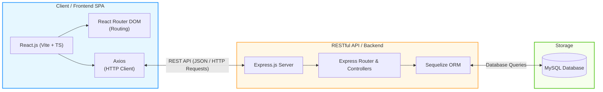

# Perbandingan System Design: Sistem Anda vs. Sistem Teman Anda

Berikut adalah analisis dan visualisasi arsitektur sistem yang Anda bangun saat ini dibandingkan dengan sistem teman Anda.

---

## 1. Perbedaan Utama di Arsitektur

### Sistem Teman Anda (Laravel + Inertia + React/Vue + MySQL)
Sistem ini menggunakan pendekatan **Monolitik Modern (Single-Page App Monolith)** dengan **Inertia.js** sebagai jembatan (*bridge*):
*   **Routing & Controller:** Semua diatur oleh Laravel di backend.
*   **Inertia.js Bridge:** Menghubungkan Laravel controller langsung ke komponen React/Vue tanpa perlu membangun REST API secara terpisah dan manual. Data dikirim langsung sebagai *props* ke React/Vue.
*   **Database:** Menggunakan MySQL dengan ORM bawaan Laravel, yaitu **Eloquent**.

### Sistem Anda (React Vite SPA + Express.js API + MySQL)
Sistem Anda menggunakan pendekatan **Decoupled Architecture (Client-Server Split / decoupled SPA)** yang memisahkan Frontend dan Backend secara penuh:
*   **Frontend (React.js + Vite + TypeScript):** Berdiri sendiri sebagai *Single Page Application* (SPA). Mengatur routing sendiri menggunakan **React Router DOM** dan melakukan state management dengan **Zustand**.
*   **API Client (Axios):** Mengirim request HTTP secara asinkron ke server backend secara manual.
*   **Backend (Express.js):** Bertindak murni sebagai **RESTful API** yang mengembalikan data berformat JSON.
*   **Database:** Menggunakan MySQL dengan ORM **Sequelize** untuk mengelola query dan migrasi database.

---

## 2. Diagram Perbandingan

### Diagram Sistem Anda (React + Express + Sequelize + MySQL)

### Perbandingan Komponen Sistem

| Komponen | Sistem Teman Anda (Inertia) | Sistem Anda (Decoupled SPA) | Fungsi di Sistem Anda |
| :--- | :--- | :--- | :--- |
| **Frontend Framework** | React / Vue | **React (Vite + TypeScript)** | Membuat antarmuka pengguna (UI) yang dinamis. |
| **Routing & Navigation**| Diatur oleh backend (Laravel routes) | **React Router DOM (Client-Side)** | Mengatur perpindahan halaman secara instan di sisi browser. |
| **Backend Framework**  | Laravel (PHP) | **Express.js (Node.js)** | Menyediakan API endpoints untuk mengolah logika bisnis. |
| **Penghubung (Bridge/API)**| Inertia.js Bridge (tanpa REST API manual) | **RESTful API + Axios (HTTP Client)** | Komunikasi antara React dan Express menggunakan JSON. |
| **Database ORM** | Eloquent ORM | **Sequelize ORM** | Memetakan tabel database MySQL ke objek JavaScript di Backend. |
| **Database Engine** | MySQL | **MySQL** | Menyimpan seluruh data aplikasi (Wedding/Maba). |

---

## 3. Kelebihan Arsitektur Sistem Anda

1. **Pemisahan Peran yang Jelas (Separation of Concerns):** Frontend dan Backend benar-benar terpisah. Anda bisa mendeploy frontend di layanan gratis seperti Vercel/Netlify dan backend di VPS terpisah.
2. **Fleksibilitas Masa Depan:** Jika ingin membuat aplikasi mobile (React Native/Flutter), Anda bisa memakai Backend Express.js yang sama tanpa perlu mengubah logika backend.
3. **Kinerja Frontend yang Cepat:** Menggunakan Vite + TypeScript membuat proses build sangat cepat dan runtime yang efisien.
